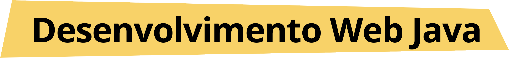
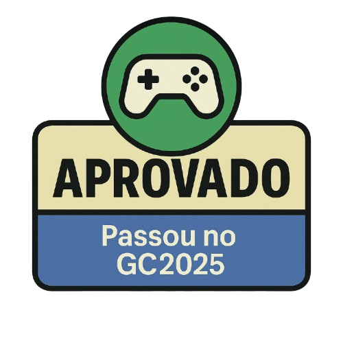
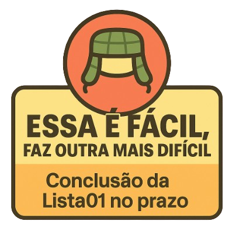
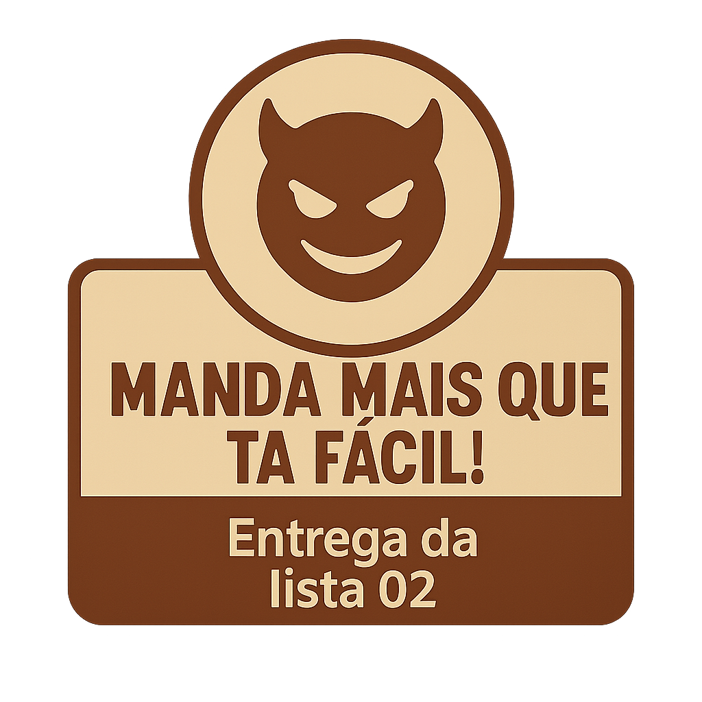
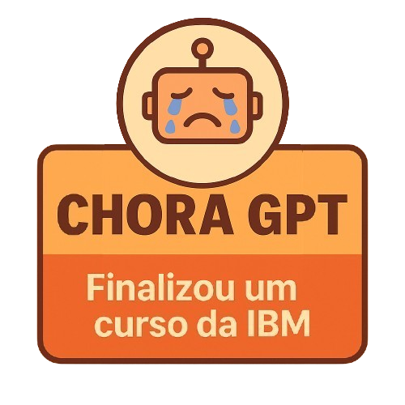
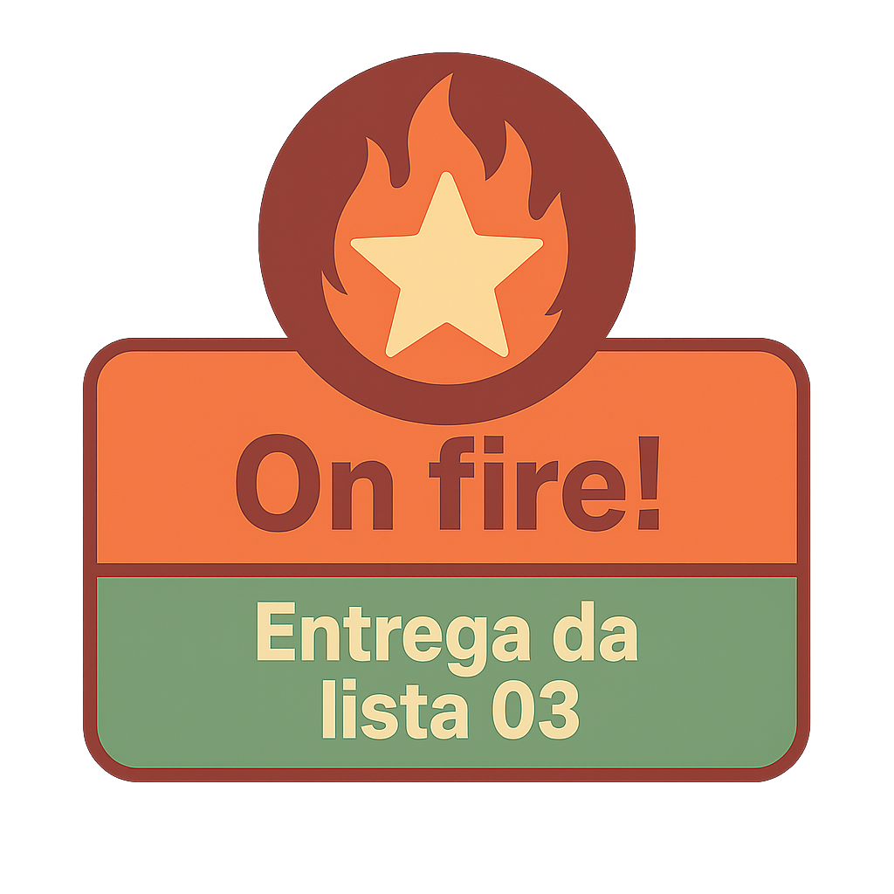

<!--  -->
<p align="center">
  

---
## Conquistas
<p align="center">
  
  
  
  
  
    

</p>


---
## -  Conquistas
Progressão: Ganhe conquistas ao ter presença e participação das aulas, completar exercicios e desafios. 

Recompensas: Conquistas alem de serem lindas, podem ser usadas como vantagem no projeto final. 

## - Cursos que Valem Conquistas :trophy:

Além da presença, participação nas aulas e desafios, você pode ganhar **conquistas especiais** ao concluir cursos online recomendados.  

Esses cursos não só vão turbinar seus conhecimentos, mas também vão render **badges exclusivas** que podem ser usadas como vantagem no projeto final.  

:point_right: Faça o curso, conclua todas as etapas e mostre o certificado no Discord para garantir sua conquista.  

### Cursos Disponíveis:
- [🚀 Fundamentos de IA com a IBM](https://ibm.biz/Eldorado-CALDEIRA)  — *basta se matricular em apenas um dos cursos, só de concluir e apresentar o certificado você já garante a badge!* 
- [💡 Trilha TIC em Trilhas](https://ticemtrilhas.org.br/trail/e100cc0c-1941-4b58-91b6-8c37264057ec)  

## - Em caso de Dúvidas?? :fearful:

No caso que tenha alguma dúvida ou sinta que precisa de ajuda, nos Vamos te ajudar :punch: 
Basta usar o Discord!

:point_right: Use títulos fáceis de entender e de filtrar. Como por exemplo:

... :heavy_check_mark: Como resolver o algoritmo da aula X?

... :heavy_check_mark: [Aula X] Erro na verificação do algoritmo

**Participe, pergunte, ajude e colabore.**

> Tentaremos responder todas as dúvidas o mais rápido possível, mas pode ser difícil atender a todos se houver muitas questões. É essencial que você pesquise e corra atrás da solução também. Tenha em mente que o autodidatismo é super importante e muito valorizado na TI.

...

## - Find ME!(valendo conquista)
Eu sou uma entidade que gosta de charadas, se você quer um desafio maior responda as perguntas que eu fizer. Responda abaixo as perguntas commitando as respostas, que elas serão verificadas. Se todas tiverem corretas vocês uma conquista!

Pergunta e resposta de exemplo 

Qual minha bebida favorita? ❌
```
Resposta: Chá verde
```
Qual minha bebida favorita? :heavy_check_mark:

```
Resposta: Café
```
-=-=-=-=-=-=-=-=-=-=-=-=-=-=-=-=-=-=-=-=-=-=-=-=-=-=-=-=-=-=-=-=-=-=-=-=-=-=-=-=-=-=-=-=-=-=-=-=-=-=-=-=-=-=-=-=-=-=-=-=-=-=-=-=-=-=-=-=-=-=-=-=-=-=-=-=

Qual minha comida favorita escrita ao contrário?
```
Resposta:  ihsus ✔️
```
Qual o meu anime favorito?
```
Resposta: One Piece ✔️
```
Qual meme que eu mandei o Giancarlo fez que está referenciando em um vídeo?
```
Resposta:
```
Qual o melhor alien do Ben10?
```
Resposta: fantasmatico
```
Qual o meu cantor favorito?
```
Resposta: Oliver Sykes
```
